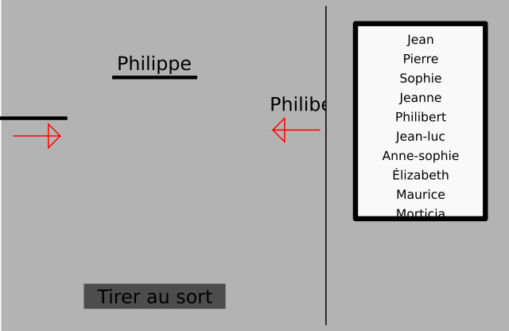

# Tirage au sort de toute beauté

## Énoncé

```python
const CHARACTERS = {
  Jean = 0.015,
  Pierre = 0.0089,
  Sophie = 0.000059,
  Jeanne = 0.010045,
  Philibert = 0.0149,
  JeanLuc = 0.0198,
  AnneSophie = 0.01024,
  Elizabeth = 1.010085,
  Maurice = 0.018901,
  Morticia = 0.0200401
}
```

Comme dans l'exercice précédent, vous devrez tirer au sort chacunes des personnes de la liste ci-dessus pour les faires apparaître dans l'oredre de tirage



Une personne ne peut être tirée au sort qu'une seule fois, et lorsqu'elle est tirée au sort, son nom doit disparaitre de la lsite des personnes tirées au sort.

Pour déclencher le tirage, il faudra cliquer sur un bouton 'Tirer au sort'.

La scène doit être de résolution 800x600

## Correction

[Voir la correction](./correction)

## Exécuter le script

```shell
godot -path correction/
```
