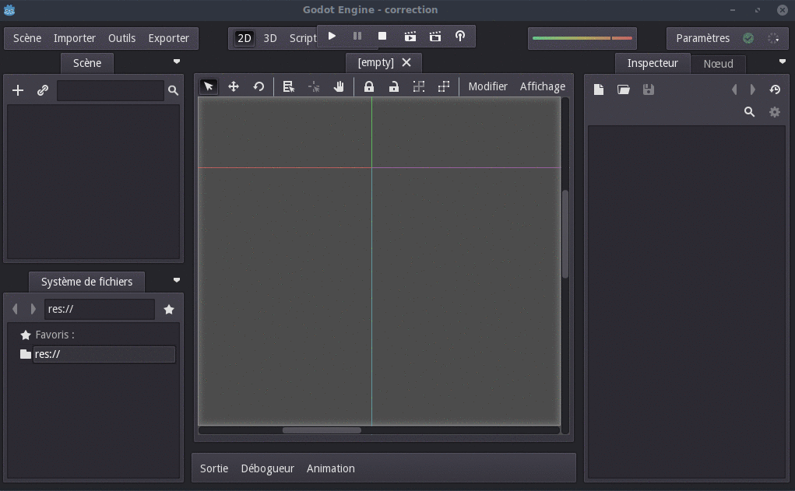

# Les thèmes dans Godot

## Énoncé

Créer un thème dans godot engine permet de gagner du temps lorsqu'on fait un jeu. En utilisant un thème préconstruit de votre choix, créez un nouveau thème pour les objets suivants:
- Button
- Panel
- PanelContainer
- LineEdit
- PopupPanel
- Fonts
- Spinbox
- MarginContainer

Pour ceux qui n'ont pas trouvé de thème a leur goùt, nous allons utiliser les assets de [Kenney](http://kenney.nl/assets/ui-pack), vous pouvez les [téléchargez ici](./uipack.zip)

Voici comment créer un thème dans Godot:
