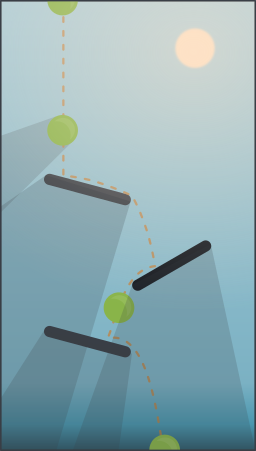

# La physique dans godot

## Énoncé

Dans cet exercice nous allons faire tomber une balle en boucle.
Une source de lumière sera là pour générer des ombres dynamiques.
Plusieurs plateformes seront disposées sur la scène afin de complexifier la trajectoire de la balle.

La ligne orange sur l'illustration représente la trajectoire approximative de la balle.

Voici les ressources pour mener a bien cet exercice:

[Resources](./resources.tar.gz)
