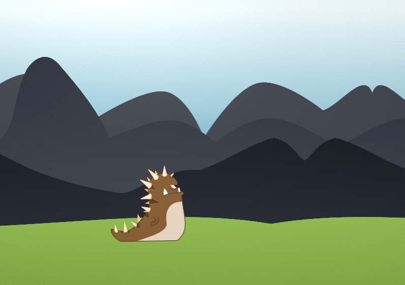

# Gestion d'un personnage avec mouvement

## Énoncé

Dans cet exercice nous allons voir comment animer un personnage lorsqu'i lse déplace. Il existe plusieurs techniques.
Cependant cet exercice utilisera une technique très simple qui consiste a avoir une animation sans os.
Nous allons re-utiliser le fond en parallaxe pour cet exercice.

Voici les ressources pour mener a bien cet exercice:

[Resources](./resources.tar.gz)
