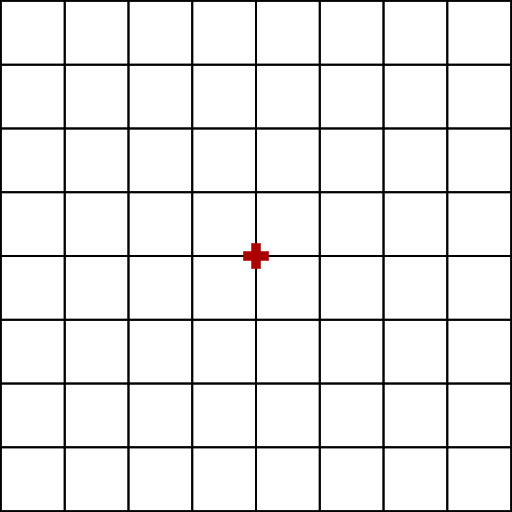

# Génération d'une grille à la volée

## Énoncé

A l'aide de Godot Engine, créez une scène ne comportant qu'un seul de type Node2D.
Lorsque ce noeud est ajouté a une scène il doit dessiner une grille à l'écran. Ce noeud doit exposer 4 paramètres qui doivent être modifiables par l'interface des noeuds de Godot Engine.

Voici les 4 paramètres a exposer:

- L'interval x
- L'interval y
- La largeur de la grille
- La longueur de la grille

La grille doit être centrée sur l'origine du noeud. Autrement dit, le (x, y) d'origine ne doit pas être confondu avec l'origine du noeud.

|INVALIDE|VALIDE|
|---|---|
|||

## Bonus

Ajouter un cinquième paramètre permettant d'effectuer une rotation de la grille suivant un angle donné

## Correction

[Voir la correction](./correction)

## Exécuter le script

```shell
godot -path correction/
```
